# DogFood Platform — System Architecture

> **File:** `ARCHITECTURE.md`  
> **Status:** V1 Architecture Baseline  
> **Architecture Style:** Modular Monolith  
> **Backend:** Python + FastAPI  
> **Frontend:** Next.js + React + TypeScript  
> **Database:** PostgreSQL  
> **ORM / Migrations:** SQLAlchemy 2 + Alembic  
> **Validation:** Pydantic v2  

---

# 1. Purpose

DogFood is a hackathon-management platform covering the complete hackathon lifecycle:

- public event discovery;
- participant registration;
- team creation and joining;
- project submission;
- anonymous judge assignment and scoring;
- organizer/admin operations;
- winner selection;
- result publication;
- governance and moderation;
- platform-level Super Admin control.

This document is the implementation architecture for V1.

The architecture is designed to be:

- fast enough to build for a hackathon;
- clean enough to extend;
- secure around judging and participant identity;
- explicit about authorization;
- auditable for privileged operations;
- testable at policy, service, API, and database levels.

---

# 2. Locked V1 Technology Decisions

| Area | Decision |
|---|---|
| Architecture | Modular monolith |
| Backend language | Python |
| Backend framework | FastAPI |
| API | REST + JSON |
| Frontend | Next.js + React + TypeScript |
| Database | PostgreSQL |
| ORM | SQLAlchemy 2 |
| Migration tool | Alembic |
| Validation / DTOs | Pydantic v2 |
| Password hashing | Argon2id |
| Authentication | Access + refresh/session architecture |
| Authorization | Explicit contextual policy layer |
| File storage | S3-compatible object storage |
| Email | Provider adapter |
| Backend tests | Pytest + HTTPX |
| Deployment | Separate web/API deployments + managed PostgreSQL |

---

# 3. Architecture Style

DogFood should start as a **modular monolith**, not microservices.

The platform contains several domains, but many important operations cross those domains and must be atomic.

Examples:

```text
Submit project
→ validate leader
→ validate deadline
→ validate team size
→ create project
→ snapshot team members
→ lock roster
→ audit
→ commit
```

and:

```text
Publish results
→ calculate final scores
→ create publication
→ snapshot result entries
→ snapshot awards
→ update current publication
→ audit
→ commit
```

Splitting these into microservices would create unnecessary distributed-transaction and operational complexity.

The design therefore uses:

```text
one FastAPI application
+
one PostgreSQL database
+
strong internal domain boundaries
```

---

# 4. High-Level Architecture

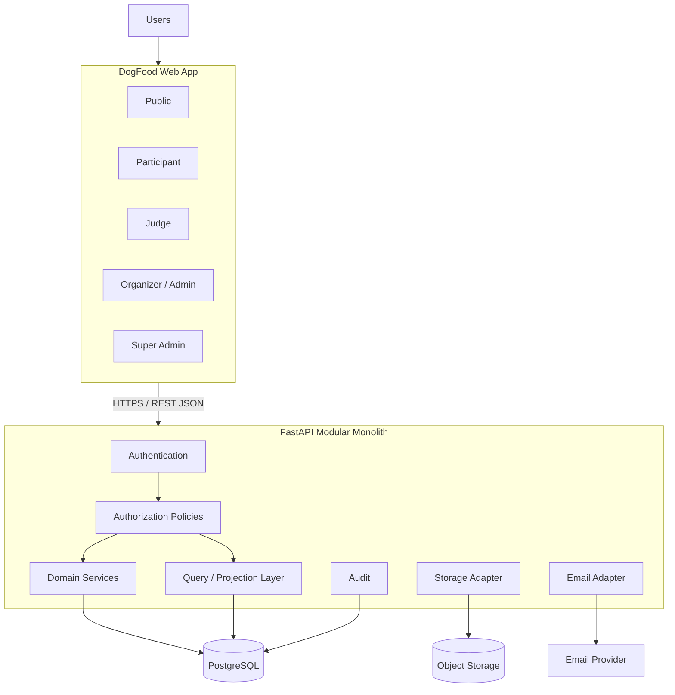

---

# 5. Product Experiences

DogFood contains five experiences inside one web product.

## 5.1 Public

Public users may:

- browse hackathons;
- view overview;
- schedule;
- tracks;
- rules;
- prizes/awards;
- sponsors;
- public judge profiles;
- announcements;
- join an open hackathon;
- view published results;
- view project gallery after publication when enabled.

Project content should not be publicly exposed during active competition/judging.

Aggregate counts may be public.

---

## 5.2 Participant

Participants may:

- register;
- accept rules and terms;
- create/update hackathon profile;
- create/join a team when permitted;
- browse team discovery if opted in;
- leave team before roster lock;
- view their team;
- view their project;
- view published results.

---

## 5.3 Team Leader

**Team Leader is not a separate hackathon membership role.**

It is derived from:

```text
membership.role == PARTICIPANT
AND
team.leader_user_id == current_user.id
```

Team Leader capabilities include:

- edit team;
- generate invites;
- remove members before submission;
- submit project;
- edit project before deadline;
- delete project before deadline.

This avoids duplicating leadership state.

---

## 5.4 Judge

A Judge may:

- view assigned projects only;
- see a judge-safe anonymous project projection;
- view participant count;
- score assigned projects;
- create/update own review before `judging_end_at`.

Judge must not see:

```text
team name
participant name
email
username
profile picture
LinkedIn/profile metadata
other judge scores
average score
current ranking
```

---

## 5.5 Organizer / Admin

Organizer and Admin use the same management frontend.

Authorization controls available actions.

Organizer examples:

```text
settings
deadlines
team rules
judging configuration
admin management
winner selection
result publication
governance requests
```

Admin examples:

```text
participants
teams
project read access
judge operations
judging progress
rankings
participant moderation
```

Admin is not simply a lower numeric level of Organizer.

Permissions remain explicit.

---

## 5.6 Super Admin

Super Admin is platform scoped.

Capabilities include:

- all-hackathon oversight;
- platform user oversight;
- moderation;
- deletion-request review;
- ownership-transfer review;
- governance approval;
- platform announcements.

Super Admin comes from:

```text
USERS.is_super_admin
```

not a hackathon membership role.

---

# 6. Backend Layers

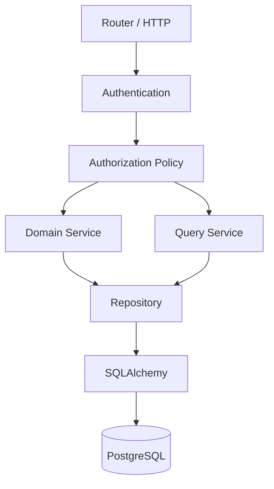

Rules:

- routers own HTTP concerns;
- routers do not own SQL;
- routers do not contain business logic;
- policies own authorization decisions;
- services own use cases;
- repositories own persistence operations;
- query services build audience-specific read models;
- database constraints protect structural invariants.

---

# 7. Repository Layout

```text
dogfood/
├── apps/
│   ├── web/
│   │   ├── src/
│   │   ├── public/
│   │   └── package.json
│   │
│   └── api/
│       ├── app/
│       │   ├── main.py
│       │   ├── config.py
│       │   │
│       │   ├── core/
│       │   │   ├── database.py
│       │   │   ├── security.py
│       │   │   ├── errors.py
│       │   │   ├── clock.py
│       │   │   ├── logging.py
│       │   │   ├── pagination.py
│       │   │   └── request_id.py
│       │   │
│       │   ├── auth/
│       │   ├── authorization/
│       │   ├── users/
│       │   ├── hackathons/
│       │   ├── registrations/
│       │   ├── teams/
│       │   ├── projects/
│       │   ├── judging/
│       │   ├── results/
│       │   ├── awards/
│       │   ├── governance/
│       │   ├── announcements/
│       │   ├── audit/
│       │   ├── storage/
│       │   └── email/
│       │
│       ├── migrations/
│       ├── tests/
│       ├── alembic.ini
│       └── pyproject.toml
│
├── docs/
│   ├── ARCHITECTURE.md
│   ├── AUTHORIZATION.md
│   ├── API_CONTRACT.md
│   └── adr/
│
├── infra/
├── docker-compose.yml
├── .env.example
└── README.md
```

---

# 8. Domain Module Template

For a complex module:

```text
projects/
├── models.py
├── schemas.py
├── repository.py
├── service.py
├── policy.py
├── queries.py
├── router.py
├── errors.py
└── tests/
```

Responsibilities:

| File | Purpose |
|---|---|
| `models.py` | SQLAlchemy persistence models |
| `schemas.py` | Pydantic requests/responses |
| `repository.py` | persistence operations |
| `service.py` | business use cases |
| `policy.py` | domain authorization |
| `queries.py` | audience-specific read projections |
| `router.py` | HTTP endpoints |
| `errors.py` | domain errors |

Do not create empty files purely for symmetry.

---

# 9. Main Domains

```text
Identity
Hackathons
Registration
Teams
Projects
Judging
Results
Awards
Governance
Announcements
Authorization
Audit
Storage
Email
```

---

# 10. Identity Domain

Owns:

- users;
- login;
- logout;
- current-user resolution;
- email verification;
- account disablement;
- password management;
- authentication invalidation;
- platform Super Admin flag.

Core user fields:

```text
id
email
username
password_hash
full_name
country
is_super_admin
email_verified_at
disabled_at
auth_version
```

A user is allowed to authenticate only when:

```text
user exists
AND
disabled_at IS NULL
AND
credential is valid
AND
credential auth_version == user.auth_version
```

---

# 11. Authentication

Recommended architecture:

```text
Email + password
       ↓
Argon2id password verification
       ↓
Short-lived access token/session
       ↓
Refresh credential
```

Rules:

- never store plain passwords;
- never return password hashes;
- do not treat token role claims as permanent authorization truth;
- reload current account state;
- use `auth_version` to invalidate active credentials when necessary.

---

# 12. Authorization Model

DogFood authorization operates across four scopes.

```text
PLATFORM
└── Super Admin

HACKATHON
├── Organizer
├── Admin
├── Judge
└── Participant

TEAM
├── Team Leader
└── Team Member

RESOURCE
├── Project ownership
├── Judge assignment
└── Review ownership
```

Real authorization is:

```text
role
+
membership
+
resource relationship
+
ownership
+
assignment
+
time
+
hackathon phase
+
resource state
```

Do not use simple role hierarchy inheritance.

---

# 13. Authorization Request Flow

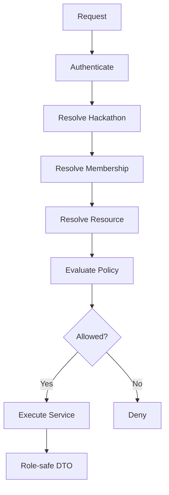

---

# 14. Authorization Context

Standardize policy inputs with an authorization context.

Conceptually:

```python
AuthorizationContext(
    user=current_user,
    hackathon=hackathon,
    membership=membership,
    team=team,
    project=project,
    judge_assignment=assignment,
    review=review,
    phase=phase,
    now=clock.now(),
)
```

Only relevant fields are populated.

---

# 15. Explicit Capabilities

Suggested permission names:

```text
hackathon.view_public
hackathon.edit_settings
hackathon.change_deadlines
hackathon.configure_judging
hackathon.configure_team_rules

team.create
team.view_own
team.edit
team.invite
team.leave
team.remove_member

project.view_own
project.submit
project.edit
project.delete
project.override_edit
project.disqualify

judge.assignment.view
judge.review.create
judge.review.edit

results.view_internal
results.select_winner
results.publish

participant.ban

admin.create
admin.remove

governance.request_delete
governance.request_transfer
governance.review_request

announcement.hackathon.manage
announcement.platform.manage
```

---

# 16. Hackathon Phase Service

Do not compare timestamps independently throughout the application.

Create:

```text
HackathonPhaseService
```

Suggested phases:

```text
DRAFT
REGISTRATION_UPCOMING
REGISTRATION_OPEN
REGISTRATION_CLOSED
HACKING
SUBMISSION_CLOSED
JUDGING
JUDGING_CLOSED
RESULTS_PUBLISHED
ENDED
```

Derived from:

```text
lifecycle_status
registration_start_at
registration_end_at
hackathon_start_at
submission_deadline_at
judging_start_at
judging_end_at
hackathon_end_at
current_result_publication_id
```

All policies use the same phase calculation.

---

# 17. Hackathon Domain

Owns:

```text
HACKATHONS
HACKATHON_MEMBERSHIPS
HACKATHON_RULES_VERSIONS
HACKATHON_TRACKS
HACKATHON_SPONSORS
HACKATHON_SCHEDULE_ITEMS
```

Main services:

```text
create_hackathon()
update_hackathon()
publish_hackathon()
change_deadlines()
configure_team_rules()
create_rules_version()
set_current_rules_version()
create_track()
update_track()
delete_track()
create_sponsor()
update_sponsor()
create_schedule_item()
```

Competition-integrity changes must be auditable.

---

# 18. Registration Domain

Owns:

```text
HACKATHON_REGISTRATIONS
PARTICIPANT_PROFILES
```

Workflow:

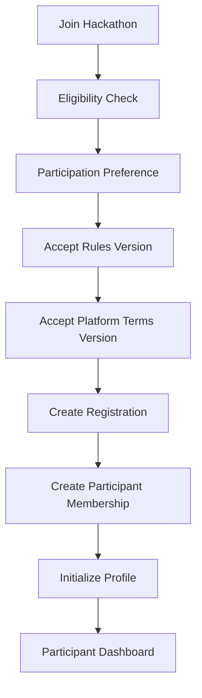

Registration stores snapshots/references to the exact rules and terms accepted.

---

# 19. Team Rules

V1 should derive solo participation from:

```text
team_min_size
team_max_size
```

Use one source of truth.

```text
min=1 max=1
→ solo only

min=1 max>1
→ solo or team

min>1
→ team required
```

Do not introduce a redundant `allow_solo` flag unless later requirements make it necessary.

---

# 20. Teams Domain

Owns:

```text
TEAMS
TEAM_MEMBERS
TEAM_MEMBERSHIP_EVENTS
TEAM_INVITES
TEAM_INVITE_REDEMPTIONS
```

Services:

```text
create_team()
rename_team()
generate_invite()
revoke_invite()
redeem_invite()
leave_team()
remove_member()
transfer_leadership()
lock_roster()
```

Prefer business-action endpoints over generic CRUD.

---

# 21. Team Invariants

## One Team per Hackathon

A participant may belong to only one team within one hackathon.

Enforce through the database relationship:

```text
(hackathon_id, user_id)
```

## Capacity

```text
current_member_count <= team_max_size
```

## Submission Minimum

```text
current_member_count >= team_min_size
```

## Leadership

```text
team.leader_user_id must be a current member of team
```

## Roster Lock

After submission:

```text
roster_locked_at IS NOT NULL
```

Normal leave/remove operations are denied.

Administrative banning is handled separately.

---

# 22. Invite Redemption Transaction

```text
BEGIN

load invite with row lock
validate invite exists
validate not revoked
validate not expired
validate usage limit
validate participant membership
validate participant not already in team
validate team capacity

insert TEAM_MEMBERS
insert TEAM_MEMBERSHIP_EVENTS
insert TEAM_INVITE_REDEMPTIONS
increment invite use_count

COMMIT
```

Any failure:

```text
ROLLBACK
```

---

# 23. Projects Domain

Owns:

```text
PROJECTS
PROJECT_SUBMISSION_MEMBERS
PROJECT_LINKS
PROJECT_MEDIA
PROJECT_TECHNOLOGIES
```

Main operations:

```text
submit_project()
edit_project()
delete_project()
get_team_project()
override_project()
disqualify_project()
```

One project per team is enforced by unique `PROJECTS.team_id`.

---

# 24. Structured Project Story

The UI and judge experience use separate story sections.

Recommended project fields:

```text
name
tagline
inspiration
what_it_does
how_it_was_built
challenges
accomplishments
what_we_learned
whats_next
```

If the existing schema currently stores only `description` + `story`, migrate before implementing the final submission API.

Typed fields are preferable to an uncontrolled JSON payload because they improve:

- validation;
- OpenAPI documentation;
- judge rendering;
- future search;
- analytics;
- migration safety.

---

# 25. Project Submission Transaction

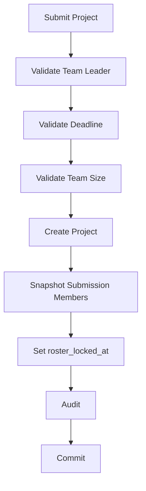

The project and official submission-member snapshot must either both exist or neither exist.

---

# 26. Project Edit Policy

Normal edit:

```text
actor is current team leader
AND
project belongs to actor's team
AND
project.deleted_at IS NULL
AND
project.disqualified_at IS NULL
AND
now < hackathon.submission_deadline_at
```

After deadline:

```text
normal update/delete denied
```

---

# 27. Organizer Project Override

Organizer override must be a separate use case.

```text
override_project(
    actor,
    project_id,
    changes,
    reason
)
```

Requirements:

- authorized Organizer;
- reason mandatory;
- before data captured;
- after data captured;
- audit event created.

Never silently mutate contestant submissions.

---

# 28. Project Read Projections

Do not create one universal project response.

## ParticipantProjectResponse

May contain:

```text
team
members
project content
links
technologies
media
submission timestamps
```

## ManagementProjectResponse

May contain:

```text
team
participant identities
moderation state
submission metadata
disqualification state
```

## JudgeProjectResponse

Contains only:

```text
project_id
name
tagline
structured story
technologies
media
allowed links
participant_count
rubric
own review state
```

Explicitly exclude:

```text
team name
participant names
emails
usernames
avatars
external participant profiles
other judges
other scores
average score
ranking
```

Prefer a query that never selects forbidden fields.

---

# 29. Object Storage

Media files live in S3-compatible object storage.

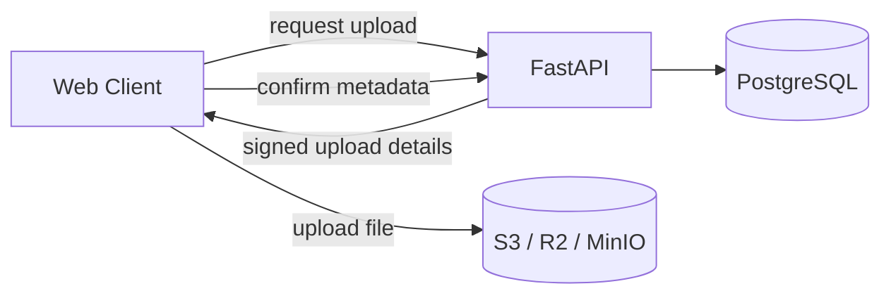

Database stores metadata such as:

```text
storage_key
mime_type
size_bytes
caption
sort_order
```

Validate type, size, ownership, and upload completion.

---

# 30. Judge Domain

Owns:

```text
JUDGE_INVITES
JUDGE_PROFILES
JUDGE_ASSIGNMENTS
JUDGING_CRITERIA
JUDGE_REVIEWS
JUDGE_SCORES
```

The judge assignment is the core security boundary.

---

# 31. Assignment-Scoped Judge API

Prefer:

```text
GET /api/v1/judge/hackathons/{hackathon_id}/assignments
GET /api/v1/judge/assignments/{assignment_id}
PUT /api/v1/judge/assignments/{assignment_id}/review
```

Judge access condition:

```text
assignment exists
AND
assignment.judge_user_id == current_user.id
AND
assignment.revoked_at IS NULL
AND
assignment belongs to current hackathon
```

Otherwise deny.

Do not give judges a generic unrestricted `/projects/{project_id}` read path.

---

# 32. Judge Conflict Rule

Assignment creation must reject:

```text
judge appears in PROJECT_SUBMISSION_MEMBERS
```

Even if roles are mutually exclusive today, keep this check as defense in depth.

---

# 33. Judge Review Rules

Judge:

```text
CREATE own review ✅
READ own review ✅
UPDATE own review ✅ before judging_end_at
DELETE submitted review ❌
```

After judging ends:

```text
review mutation = locked
```

Management invalidation is a separate audited action.

---

# 34. Judging Criteria

Criteria contain:

```text
name
description
weight_bps
max_score
sort_order
```

Before rubric lock:

```text
sum(weight_bps) == 10000
```

Recommended V1 rule:

```text
rubric cannot change after judging starts
```

---

# 35. Score Validation

For each score:

```text
0 <= score <= criterion.max_score
```

Client does not submit trusted final totals.

Backend calculates normalized weighted values.

Concept:

```text
normalized = score / max_score
weighted = normalized * criterion_weight
```

---

# 36. Results Domain

Owns:

```text
AWARDS
RESULT_PUBLICATIONS
RESULT_ENTRIES
RESULT_AWARDS
```

Keep separate:

```text
score calculation
winner selection
result publication
```

These are distinct actions and permissions.

---

# 37. Results Workflow

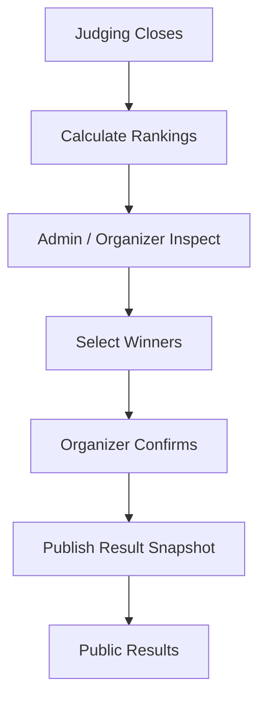

---

# 38. Immutable Result Publications

Published results are snapshots.

Do not silently update a historical publication.

Correction:

```text
Publication #1
    ↓
correction
    ↓
Publication #2
supersedes Publication #1
```

Snapshot:

```text
final scores
review count
ranking
project-name snapshot
award-name snapshot
prize snapshot
selected winner
scoring method
calculation snapshot
```

---

# 39. Public Project Gallery

Use:

```text
result_gallery_mode
```

Values:

```text
WINNERS_ONLY
ALL_PROJECTS
```

Before publication:

```text
Guest → cannot inspect project content
Other participants → cannot inspect competing submissions
```

After publication:

### WINNERS_ONLY
Only award-winning projects appear.

### ALL_PROJECTS
All eligible projects may appear.

---

# 40. Governance Domain

Owns:

```text
HACKATHON_CHANGE_REQUESTS
AUDIT_EVENTS
```

Request types:

```text
DELETE_HACKATHON
TRANSFER_OWNERSHIP
```

Statuses:

```text
PENDING
APPROVED
REJECTED
```

---

# 41. Hackathon Deletion

Organizer does not directly delete a hackathon.

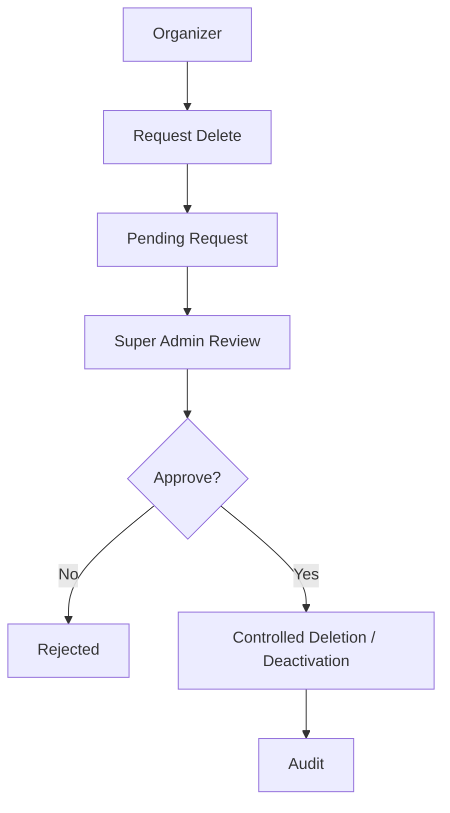

For V1, prefer controlled deactivation/soft deletion over destructive physical deletion.

---

# 42. Ownership Transfer

```text
Organizer
→ request transfer
→ target owner
→ reason
→ Super Admin review
→ approve/reject
→ transactional ownership update
→ audit
```

Organizer cannot directly transfer ownership.

---

# 43. Audit

Audit event:

```text
hackathon_id
actor_user_id
action
entity_type
entity_id
reason
before_data
after_data
request_id
created_at
```

Audit at minimum:

```text
deadline changes
team-rule changes
judging configuration changes
organizer project overrides
participant bans
judge assignments/revocations
review invalidation
winner selection
result publication
admin creation/removal
deletion requests
ownership transfers
Super Admin privileged actions
```

Operational logs and business audit events are separate concerns.

---

# 44. Announcements — Architecture Correction

The product contains both hackathon announcements and platform announcements.

Use separate scopes.

Recommended:

```text
HACKATHON_ANNOUNCEMENTS
PLATFORM_ANNOUNCEMENTS
```

Reasons:

- different audience;
- different authorization;
- different lifecycle;
- different ownership.

If the existing `ANNOUNCEMENTS` table is hackathon-scoped, retain it for hackathon announcements and add a separate platform table.

---

# 45. Commands vs Queries

Do not implement full CQRS, but separate conceptual mutation and read responsibilities.

## Commands

```text
register_for_hackathon
create_team
redeem_invite
remove_member
submit_project
override_project
assign_judge
submit_review
invalidate_review
select_winner
publish_results
request_deletion
approve_change_request
```

## Queries

```text
get_public_hackathon
get_participant_dashboard
get_hackathon_workspace
get_team_workspace
get_judge_dashboard
get_judge_assignment
get_management_overview
get_judging_progress
get_internal_rankings
get_public_results
```

---

# 46. Repository Pattern

```text
Router
  ↓
Service
  ↓
Repository
  ↓
SQLAlchemy
  ↓
PostgreSQL
```

Routers must not directly execute ORM queries.

Repositories may expose:

```text
get_by_id()
get_for_update()
get_by_team()
create()
update()
soft_delete()
list_for_management()
```

Specialized query services may issue optimized projection queries.

Do not force every read into generic CRUD.

---

# 47. Critical Transactions

## Participant Registration

```text
registration
membership
profile initialization
```

## Invite Redemption

```text
invite lock
capacity check
membership
history
redemption
use count
```

## Project Submission

```text
project
submission-member snapshot
roster lock
audit
```

## Judge Assignment

```text
conflict validation
assignment
audit
```

## Result Publication

```text
calculation snapshot
publication
result entries
award snapshots
current-publication pointer
audit
```

## Ownership Transfer Approval

```text
request status
owner update
executed_at
audit
```

---

# 48. Concurrency

Use optimistic concurrency on resources with version fields.

Example:

```text
client loaded version 4
client updates with expected_version=4
database is version 5

→ 409 VERSION_CONFLICT
```

Apply to:

```text
TEAMS
PROJECTS
JUDGE_REVIEWS
```

Use row-level locks where race conditions affect capacity, counters, or publication.

---

# 49. Database Constraints

Service layer protects business logic.

Database protects structural truth.

Important constraints:

```text
USERS.email UNIQUE
USERS.username UNIQUE
HACKATHONS.slug UNIQUE
TEAM_MEMBERS one (hackathon_id,user_id)
PROJECTS.team_id UNIQUE
JUDGE_REVIEWS.assignment_id UNIQUE
JUDGE_SCORES unique (review_id,criterion_id)
RESULT_ENTRIES unique (publication_id,project_id)
```

Suggested checks:

```text
team_min_size >= 1
team_max_size >= team_min_size
weight_bps >= 0
score >= 0
```

---

# 50. Indexing

Likely indexes:

```text
hackathons.slug
hackathons.lifecycle_status

hackathon_memberships(hackathon_id, role)
hackathon_memberships(user_id)

team_members(team_id)
team_members(hackathon_id, user_id)

team_invites(token_hash)
team_invites(team_id)

projects(hackathon_id)
projects(team_id)
projects(track_id)

judge_assignments(judge_user_id, hackathon_id)
judge_assignments(project_id)
judge_assignments(hackathon_id, revoked_at)

judge_reviews(assignment_id)

judge_scores(review_id)
judge_scores(criterion_id)

result_publications(hackathon_id, publication_number)

audit_events(hackathon_id, created_at)
audit_events(entity_type, entity_id)
```

Validate important indexes against real query plans later.

---

# 51. API Versioning

Base:

```text
/api/v1
```

Groups:

```text
/api/v1/auth
/api/v1/public
/api/v1/hackathons
/api/v1/judge
/api/v1/manage
/api/v1/platform
```

---

# 52. Core API Contract Shape

## Auth

```text
POST /api/v1/auth/register
POST /api/v1/auth/login
POST /api/v1/auth/refresh
POST /api/v1/auth/logout
GET  /api/v1/auth/me
```

## Public

```text
GET /api/v1/public/hackathons
GET /api/v1/public/hackathons/{slug}
GET /api/v1/public/hackathons/{slug}/schedule
GET /api/v1/public/hackathons/{slug}/tracks
GET /api/v1/public/hackathons/{slug}/rules
GET /api/v1/public/hackathons/{slug}/results
GET /api/v1/public/hackathons/{slug}/projects
```

## Participant

```text
POST /api/v1/hackathons/{hackathon_id}/register
GET  /api/v1/hackathons/{hackathon_id}/workspace

POST /api/v1/hackathons/{hackathon_id}/teams
GET  /api/v1/hackathons/{hackathon_id}/team
PATCH /api/v1/teams/{team_id}

POST /api/v1/teams/{team_id}/invites
POST /api/v1/team-invites/{token}/redeem
POST /api/v1/teams/{team_id}/leave
POST /api/v1/teams/{team_id}/members/{user_id}/remove

POST   /api/v1/hackathons/{hackathon_id}/project
GET    /api/v1/hackathons/{hackathon_id}/project
PUT    /api/v1/projects/{project_id}
DELETE /api/v1/projects/{project_id}
```

## Judge

```text
GET /api/v1/judge/hackathons/{hackathon_id}/assignments
GET /api/v1/judge/assignments/{assignment_id}
PUT /api/v1/judge/assignments/{assignment_id}/review
```

## Management

```text
GET /api/v1/manage/hackathons/{hackathon_id}/overview
GET /api/v1/manage/hackathons/{hackathon_id}/participants
GET /api/v1/manage/hackathons/{hackathon_id}/teams
GET /api/v1/manage/hackathons/{hackathon_id}/projects

GET  /api/v1/manage/hackathons/{hackathon_id}/judges
POST /api/v1/manage/hackathons/{hackathon_id}/judge-invites
POST /api/v1/manage/hackathons/{hackathon_id}/judge-assignments
DELETE /api/v1/manage/judge-assignments/{assignment_id}

GET /api/v1/manage/hackathons/{hackathon_id}/judging
GET /api/v1/manage/hackathons/{hackathon_id}/rankings

POST /api/v1/manage/hackathons/{hackathon_id}/awards/{award_id}/select
POST /api/v1/manage/hackathons/{hackathon_id}/results/publish

PATCH /api/v1/manage/projects/{project_id}/override
PATCH /api/v1/manage/hackathons/{hackathon_id}/settings
PATCH /api/v1/manage/hackathons/{hackathon_id}/deadlines

POST /api/v1/manage/hackathons/{hackathon_id}/admins
DELETE /api/v1/manage/hackathons/{hackathon_id}/admins/{user_id}

POST /api/v1/manage/hackathons/{hackathon_id}/participants/{user_id}/ban
```

## Platform

```text
GET /api/v1/platform/hackathons
GET /api/v1/platform/users
GET /api/v1/platform/change-requests

POST /api/v1/platform/change-requests/{request_id}/approve
POST /api/v1/platform/change-requests/{request_id}/reject

GET /api/v1/platform/moderation
```

---

# 53. HTTP Status Rules

Use consistent semantics:

```text
200 OK
201 Created
204 No Content
400 Bad Request
401 Unauthenticated
403 Forbidden
404 Not Found
409 Conflict
422 Validation Error
429 Rate Limited
500 Internal Error
```

For sensitive resources, `404` may be safer than confirming existence with `403`.

---

# 54. Error Envelope

```json
{
  "error": {
    "code": "PROJECT_SUBMISSION_LOCKED",
    "message": "The project can no longer be edited.",
    "details": {}
  },
  "request_id": "..."
}
```

Stable error codes:

```text
AUTH_INVALID_CREDENTIALS
HACKATHON_REGISTRATION_CLOSED
TEAM_ALREADY_MEMBER
TEAM_FULL
TEAM_ROSTER_LOCKED
PROJECT_SUBMISSION_LOCKED
JUDGE_ASSIGNMENT_NOT_FOUND
JUDGING_CLOSED
REVIEW_LOCKED
RESULTS_ALREADY_PUBLISHED
VERSION_CONFLICT
```

---

# 55. DTO Rules

Never expose ORM objects directly.

Create explicit Pydantic schemas:

```text
PublicHackathonResponse
ParticipantHackathonResponse
ManagementHackathonResponse

TeamLeaderTeamResponse
TeamMemberTeamResponse

ParticipantProjectResponse
JudgeProjectResponse
ManagementProjectResponse

JudgeAssignmentResponse
JudgeReviewRequest

InternalRankingResponse
PublicResultResponse
```

Judge anonymity depends on this discipline.

---

# 56. Frontend Stack

Recommended:

```text
Next.js
React
TypeScript
TanStack Query
React Hook Form
Zod
Tailwind CSS
```

Structure:

```text
apps/web/src/
├── app/
├── features/
│   ├── auth/
│   ├── hackathons/
│   ├── registration/
│   ├── teams/
│   ├── projects/
│   ├── judging/
│   ├── results/
│   └── management/
├── components/
│   ├── ui/
│   └── layout/
├── lib/
│   ├── api/
│   ├── auth/
│   ├── permissions/
│   └── validation/
└── types/
```

---

# 57. Frontend Routes

```text
/
├── hackathons
│   └── [slug]
│       ├── overview
│       ├── schedule
│       ├── tracks
│       ├── prizes
│       ├── rules
│       └── results
│
├── dashboard
│
├── hackathons/[slug]/workspace
│   ├── overview
│   ├── team
│   ├── project
│   ├── timeline
│   └── results
│
├── judge/hackathons/[id]
│   ├── assignments
│   └── assignments/[assignmentId]
│
├── manage/[hackathonId]
│   ├── overview
│   ├── participants
│   ├── teams
│   ├── projects
│   ├── tracks
│   ├── judges
│   ├── judging
│   ├── results
│   ├── sponsors
│   ├── settings
│   └── admins
│
└── platform
    ├── hackathons
    ├── users
    ├── moderation
    ├── requests
    └── announcements
```

---

# 58. Frontend Authorization

Frontend permissions improve UX only.

```tsx
if (permissions.canEditProject) {
  return <EditProjectButton />;
}
```

The backend independently rechecks every protected operation.

Never rely on CSS, hidden buttons, disabled components, or route guards as security.

---

# 59. Email Adapter

Create an interface independent of provider.

```python
class Mailer:
    async def send(self, message: EmailMessage) -> None:
        ...
```

Use for:

```text
email verification
password reset
team invite
judge invite
```

Possible providers:

```text
Resend
Postmark
SendGrid
AWS SES
```

Domain modules do not call provider SDKs directly.

---

# 60. Security

## Passwords

- Argon2id;
- never log credentials;
- never expose hashes.

## Sessions/Tokens

- short-lived access credential;
- protected refresh flow;
- server-side account state validation;
- `auth_version` invalidation.

## CORS

Allow only known frontend origins.

## Cookies

If cookies are used:

```text
HttpOnly
Secure
SameSite
```

and use CSRF protection for unsafe browser requests where required.

## Rate Limiting

Apply at least to:

```text
login
registration
password reset
invite redemption
upload initialization
review submission
```

## Secrets

Keep outside source control.

---

# 61. Judge Privacy / Data-Leak Protection

Judge data minimization must include more than JSON fields.

Review:

```text
external demo URLs
GitHub repository names
video titles
image filenames
object storage keys
uploaded metadata
```

These can accidentally reveal team identity.

If strict blind judging is required, define rules for identity-revealing external content.

---

# 62. Request IDs and Logging

Every request gets a request ID.

Use:

```text
X-Request-ID
```

If missing, backend generates one.

Include it in:

- operational logs;
- error responses;
- audit events when relevant;
- response headers.

Minimum structured logging:

```text
request_id
method
path/route
status
latency
actor_user_id when safe
hackathon_id when relevant
error_code
```

---

# 63. Time Handling

Persist:

```text
TIMESTAMPTZ
```

Store absolute time.

Hackathon defines:

```text
display_timezone
```

Rules:

- backend compares absolute timestamps;
- frontend displays using event timezone;
- inject a testable clock abstraction;
- do not depend on server-local timezone.

Example:

```python
clock.now()
```

---

# 64. Soft Delete / Revocation

Prefer stateful deactivation instead of physical deletion for competition records.

Examples:

```text
USERS.disabled_at
TEAMS.dissolved_at
PROJECTS.deleted_at
PROJECTS.disqualified_at
JUDGE_ASSIGNMENTS.revoked_at
JUDGE_REVIEWS.invalidated_at
ANNOUNCEMENTS.deleted_at
```

This preserves audit/history.

---

# 65. Rules Versioning

Registration stores:

```text
accepted_rules_version_id
rules_accepted_at
```

Never overwrite accepted rules history.

The same applies to platform terms:

```text
accepted_terms_version_id
terms_accepted_at
```

---

# 66. Rubric Lock

When judging starts:

```text
rubric_locked_at
```

Normal rubric mutation is denied.

For V1:

```text
no judging-criteria edits after judging starts
```

is the safest rule.

---

# 67. Migration Strategy

All schema changes use Alembic.

Suggested initial sequence:

```text
0001_users_and_terms
0002_hackathons_and_memberships
0003_registration
0004_teams
0005_projects
0006_judging
0007_results
0008_governance_and_audit
0009_announcements
```

Exact grouping may change.

Never manually patch production schema.

---

# 68. Seed Data

Create deterministic development/demo seeds.

Example users:

```text
superadmin@dogfood.local
organizer@dogfood.local
admin@dogfood.local
leader@dogfood.local
member@dogfood.local
judge1@dogfood.local
judge2@dogfood.local
```

Seed:

- one active hackathon;
- rules;
- tracks;
- schedule;
- sponsors;
- participants;
- teams;
- projects;
- criteria;
- judge assignments;
- partial reviews.

Never automatically seed production.

---

# 69. Testing Strategy

## Unit Tests

Test:

```text
policies
phase calculations
score calculations
validation
domain decisions
```

Examples:

```text
team leader cannot edit after deadline
participant cannot remove teammate
judge cannot access unassigned assignment
judge cannot see ranking
admin cannot publish if permission denied
```

## Integration Tests

Use PostgreSQL.

Test:

```text
repositories
constraints
transactions
locks
migrations
API + DB integration
```

## End-to-End

Prioritize golden path:

```text
create hackathon
→ publish
→ register participant
→ create/join team
→ submit project
→ assign judge
→ review
→ close judging
→ select winner
→ publish results
→ public result visible
```

---

# 70. Authorization Test Matrix

Sensitive endpoints should test actors such as:

```text
Guest
Participant unrelated
Participant own team
Team Leader own team
Team Leader other team
Judge assigned
Judge unassigned
Admin same hackathon
Admin other hackathon
Organizer same hackathon
Organizer other hackathon
Super Admin
```

And temporal states:

```text
registration upcoming
registration open
hacking
submission open
submission closed
judging open
judging closed
results published
```

---

# 71. Judge Data-Leak Contract Tests

For `JudgeProjectResponse`, explicitly assert the absence of:

```text
team_name
leader_user_id
member names
member emails
member usernames
avatars
profile URLs
other reviews
average score
ranking
```

Treat this as a security test.

---

# 72. Result Integrity Tests

Test:

```text
invalidated reviews excluded
revoked assignments handled
weights calculated correctly
review count correct
publication immutable
correction creates new publication
old publication preserved
current_result_publication_id moves atomically
```

---

# 73. Deployment

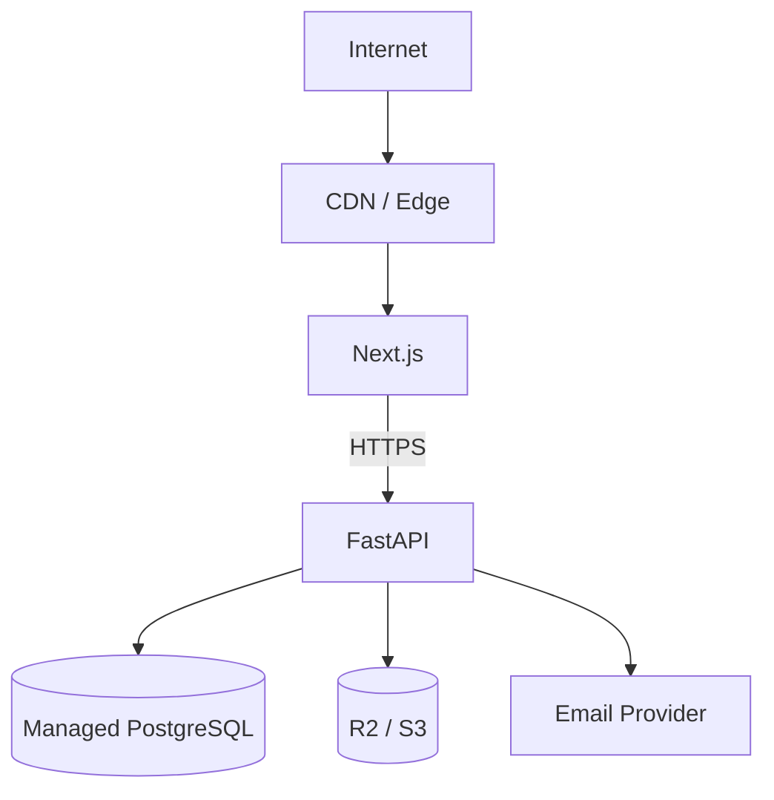

Hackathon-friendly options:

```text
Frontend → Vercel
Backend → Render / Railway / Fly.io
Database → Managed PostgreSQL
Storage → Cloudflare R2 / S3
```

Provider choice is not an architectural dependency.

---

# 74. Local Development

Use Docker Compose for infrastructure.

```text
docker compose up
```

Recommended services:

```text
postgres
minio optional
local mail catcher optional
```

`.env.example`:

```text
APP_ENV=
DATABASE_URL=
FRONTEND_URL=
APP_BASE_URL=

AUTH_SECRET=
ACCESS_TOKEN_TTL_MINUTES=
REFRESH_TOKEN_TTL_DAYS=

OBJECT_STORAGE_ENDPOINT=
OBJECT_STORAGE_BUCKET=
OBJECT_STORAGE_ACCESS_KEY=
OBJECT_STORAGE_SECRET_KEY=

EMAIL_PROVIDER=
EMAIL_API_KEY=
EMAIL_FROM=
```

Do not commit real secrets.

---

# 75. CI

Minimum pipeline:

```text
install dependencies
→ lint
→ static/type checks
→ unit tests
→ integration tests
→ migration test
→ frontend build
→ backend startup/import check
```

Optional:

```text
dependency scan
container build
Playwright smoke test
```

---

# 76. V1 Non-Goals

Deliberately excluded:

```text
real-time chat
direct messaging
full notification engine
public comments
public voting
draft project submission system
submission revision-history UI
participant activity feed
advanced analytics
native mobile app
complex automatic judge assignment
microservices
Kafka
Kubernetes
distributed workflow engine
```

Responsive web is sufficient.

---

# 77. Golden Path

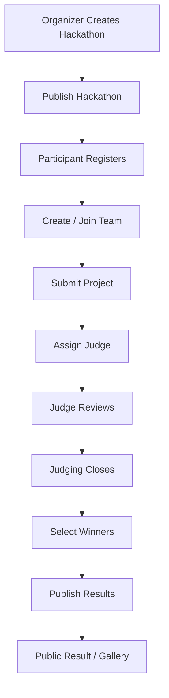

This flow should receive the highest implementation and testing priority.

---

# 78. Implementation Order

## Phase 0 — Architecture Lock

Finalize:

```text
role enums
lifecycle enums
project-story columns
announcement split
result-gallery enum
change-request enums
error envelope
```

## Phase 1 — Foundation

Build:

```text
FastAPI app
configuration
database
SQLAlchemy base
Alembic
request IDs
logging
exception handling
health endpoint
```

Deliverable:

```text
GET /health
```

## Phase 2 — Identity

Build:

```text
users
password hashing
register/login
current user
auth invalidation
```

## Phase 3 — Public Hackathon Read

Build:

```text
hackathon
rules
tracks
schedule
sponsors
public detail API
```

## Phase 4 — Registration

Build:

```text
join hackathon
terms/rules acceptance
participant membership
profile
```

## Phase 5 — Teams

Build:

```text
create
invite
redeem
view
leave
remove
capacity rules
history
```

## Phase 6 — Project Submission

Build:

```text
structured submission
links
technologies
media metadata
member snapshot
roster lock
deadline authorization
```

First major milestone:

```text
real user
→ real team
→ real submission
→ real PostgreSQL persistence
```

## Phase 7 — Judge Management

Build:

```text
judge invites
judge profiles
judge assignments
conflict validation
```

## Phase 8 — Judge Experience

Build:

```text
judge dashboard
anonymous project projection
rubric
scores
review submission
review edit
deadline lock
```

## Phase 9 — Management

Build:

```text
participants
teams
projects
judges
judging progress
simple analytics
```

## Phase 10 — Results

Build:

```text
score aggregation
rankings
awards
winner selection
publication snapshots
public results
gallery mode
```

## Phase 11 — Governance

Build:

```text
admin management
participant ban
project override
deletion request
ownership transfer
Super Admin review
audit
```

## Phase 12 — Hardening

Complete:

```text
authorization matrix tests
judge leak tests
rate limits
upload validation
demo seeds
E2E golden path
deployment
```

---

# 79. Definition of Done

A backend feature is complete only when it has:

```text
request DTO
response DTO
router
authentication
authorization policy
service
repository/query
transaction if required
database constraint if applicable
domain error codes
unit tests
integration test
audit event if privileged
sensitive-data review
OpenAPI contract
```

An endpoint returning `200` is not sufficient.

---

# 80. Core Invariants

## Identity

```text
disabled user cannot act
```

## Team Membership

```text
one participant cannot belong to multiple teams in one hackathon
```

## Leadership

```text
team leader is a member of that team
```

## Project

```text
one project belongs to one team
```

## Submission Snapshot

```text
official submission roster is frozen at submission
```

## Deadline

```text
normal project mutation stops after deadline
```

## Judge

```text
judge accesses only active assigned projects
```

## Blind Judging

```text
judge API never exposes forbidden identity/ranking data
```

## Review

```text
one review per assignment
```

## Score

```text
one score per criterion per review
```

## Results

```text
published result is immutable
```

## Governance

```text
organizer cannot directly execute ownership transfer or hackathon deletion
```

## Privileged Mutation

```text
sensitive administrative changes are auditable
```

---

# 81. Architecture Decision Records

Preserve these decisions unless intentionally changed.

## ADR-001 — Modular Monolith

One backend deployable with domain boundaries.

## ADR-002 — FastAPI

Python + FastAPI for the API-first backend.

## ADR-003 — Explicit Contextual Authorization

No security based only on frontend visibility or role hierarchy.

## ADR-004 — Team Leader as Resource Relationship

Leadership comes from `TEAMS.leader_user_id`.

## ADR-005 — Assignment-Scoped Judge API

Judge security is anchored to `JUDGE_ASSIGNMENTS`.

## ADR-006 — Role-Specific DTOs

Public, participant, judge, management, and platform responses differ.

## ADR-007 — Immutable Result Publications

Corrections create new publications.

## ADR-008 — Governance Requests

Deletion and ownership transfer require request/review workflow.

## ADR-009 — Object Storage

Project media binaries do not live in PostgreSQL.

## ADR-010 — Vertical Slice Delivery

Build complete user journeys before horizontally completing all modules.

---

# 82. Final Backend Request Model

Every protected request should conceptually execute:

```text
HTTP REQUEST
    ↓
ROUTER
    ↓
AUTHENTICATION
    ↓
RESOLVE HACKATHON / RESOURCE CONTEXT
    ↓
AUTHORIZATION POLICY
    ↓
DOMAIN SERVICE
    ↓
TRANSACTION
    ↓
REPOSITORY / QUERY
    ↓
POSTGRESQL
    ↓
AUDIT WHEN REQUIRED
    ↓
ROLE-SAFE RESPONSE DTO
```

File operation:

```text
Domain Service
→ Storage Adapter
→ Object Storage
```

Invitation:

```text
Domain Service
→ Email Adapter
→ Email Provider
```

---

# 83. Final System Architecture

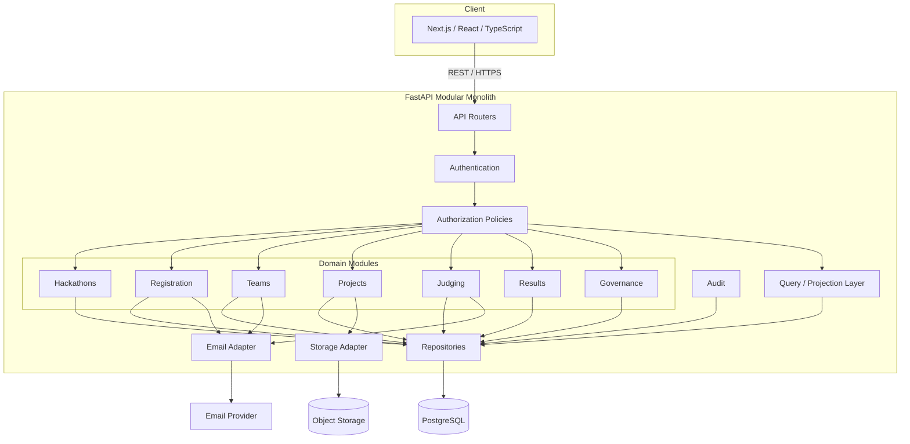

---

# 84. Senior Engineering Rule

Every new DogFood feature should preserve:

```text
Authenticate
↓
Resolve correct scope
↓
Load only required resource context
↓
Evaluate explicit policy
↓
Execute one domain use case
↓
Persist atomically
↓
Audit privileged changes
↓
Return minimum role-safe data
```

This is the core architectural rule of the project.

---

# 85. Next Technical Artifact

After `ARCHITECTURE.md`, create:

```text
API_CONTRACT.md
```

For every endpoint define:

```text
method
route
actor
request DTO
response DTO
authorization policy
service method
tables touched
transaction requirement
audit requirement
error codes
```

After that, implementation should move to:

```text
SQLAlchemy models
→ Alembic migrations
→ authentication
→ authorization context/policies
→ first vertical slice
```

---

# 86. Architecture Status

```text
Product boundaries          ✅
Frontend boundaries         ✅
Backend architecture        ✅
Domain boundaries           ✅
Authentication              ✅
Authorization               ✅
Team model                  ✅
Project lifecycle           ✅
Blind judging               ✅
Review/scoring model        ✅
Results model               ✅
Governance                  ✅
Audit                       ✅
Database rules              ✅
Storage                     ✅
Email abstraction           ✅
API shape                   ✅
Testing                     ✅
Deployment                  ✅
Implementation order        ✅
```

DogFood V1 is ready to move from architecture into API contracts, migrations, and implementation.
