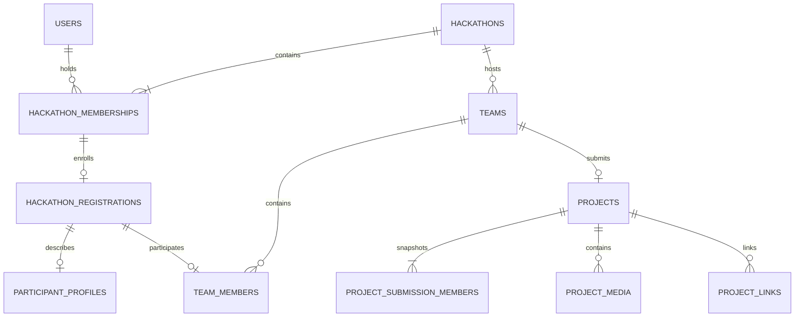
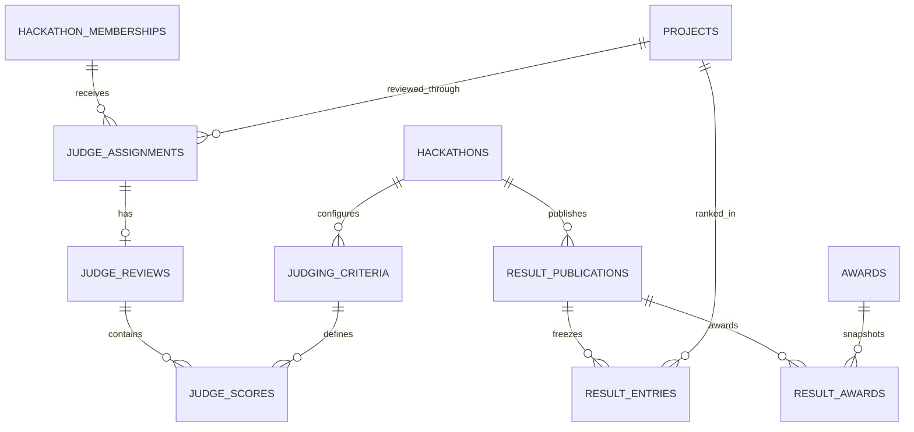

# DogFood database schema V2

Prepared for James Gurung · 26 September 2026

This replaces the original entity design with a PostgreSQL relational model that matches the supplied authorization matrix and project map. The accompanying `dogfood_schema_v2.sql` is the authoritative, complete column/constraint/index definition. It creates **33 tables** in a dedicated `dogfood` schema. `verify_schema.mjs` provides reproducible structural tests.

**Scope:** an implementation-ready database foundation for one-round hackathons, not a completed backend or production security certification. SQL enforces structural integrity and selected judging rules. FastAPI must implement the authorization and transaction contracts below. No live database has been changed. This is a greenfield script, not an upgrade migration for existing data.

## 1. Decisions carried into the redesign

| Area | V2 decision |
|---|---|
| User identity | One global user account; local password authentication assumed, as in the original schema. |
| Event role | Exactly one membership per `(hackathon_id, user_id)`, with one role: participant, judge, admin, or organizer. |
| Platform authority | `users.is_super_admin`; explicitly assigned capabilities, never role inheritance. |
| Ownership | Every retained hackathon, including a draft or archived event, has exactly one active organizer membership. |
| Creator | `created_by_user_id` is historical and never changes on ownership transfer. |
| Team leader | A participant referenced by `teams.leader_user_id`; not another event role. |
| Participation | One current team per user per hackathon. Different teams and roles in different events are supported. |
| Solo | A one-person team, including in solo-only events. No separate solo project ownership path. |
| Team limits | Maximum enforced on join; minimum enforced at submission. A forming team may be below minimum. |
| Team history | Current roster plus append-only join/leave events. Former participation remains discoverable for conflicts. |
| Submission | Zero or one project per team; no project drafts in the database. Create only on valid submission. |
| Roster freeze | First submission freezes roster independently of subsequent project deletion/restoration. |
| Project deletion | Logical deletion before the deadline; keeps project identity, authorship and evidence. Restore the same row to resubmit. |
| Team dissolution | Before any submission, a team may be dissolved and its current members removed. Retain the team shell and history. |
| Track | Zero or one track per project; the organizer can require a track in validation. |
| Judging | One round; project-level assignments; one review per assignment; one score per criterion. |
| Review draft | Internal partial score storage is supported. This is separate from the excluded project draft feature. |
| Rubric | One event-wide rubric, frozen when judging opens; integer basis-point weights total 10,000. |
| Winners | Admin/organizer select; organizer confirms and publishes. Super-admin interventions require the defined override policy. |
| Gallery | Winners only or all eligible submitted projects, after publication. |
| Announcements | Super-admin authors both platform-wide and event announcements. Organizer/admin remain read-only. |
| Deletion approval | Super-admin approval archives the hackathon. Physical purging is a separate retention operation. |
| Sponsors | Event-owned sponsor records; no shared editable global sponsor catalog. |

The following are explicit conservative defaults for unresolved differences between the matrix and map:

- Public participant counts are disabled, following the matrix.
- Discovery fields are present and opt-in defaults to false. **Do not enable participant discovery until the authorization policy explicitly permits the approved profile projection.** The current own-team-only identity rule otherwise wins.
- Judge responses omit platform identity fields. External repositories, videos and story text can still identify authors; do not promise fully anonymous judging without a separate redacted-content process.
- Undefined conditional permissions fail closed. Examples: live-average access for admin/organizer, extraordinary post-deadline overrides, and admin member removal.
- Super admins cannot submit or judge through a blanket bypass. Block competitive memberships for platform super admins under the supplied matrix; reject privilege promotion while incompatible participation/judging is active.
- No normal judging starts before submission closes. An organizer cannot extend submission into an active judging period without an explicit, audited restart policy, which is out of V1 scope.

## 2. Table catalog

### Accounts, governance and event configuration

| Table | Main fields | Source of truth / important constraints |
|---|---|---|
| `users` | email, username, password_hash, full_name, country, is_super_admin, email_verified_at, disabled_at, auth_version | Generated normalized email/username keys are unique. No event role on the user. |
| `platform_terms_versions` | version_label, body, published_at, created_by_user_id | Immutable accepted terms text. |
| `hackathons` | creator, organizer, slug, content, format/venue, display_timezone, dates, team limits, gallery mode, current rules/publication pointers, rubric lock | One organizer pointer constrained to an ACTIVE ORGANIZER membership. Lifecycle: DRAFT/PUBLISHED/CANCELLED/ARCHIVED. Date-derived phases are not stored as competing statuses. |
| `hackathon_memberships` | hackathon_id, user_id, role, status, status metadata | Composite primary key prevents duplicate membership; one role column. Unique organizer per event. |
| `hackathon_rules_versions` | event, version number, rules, eligibility description and flags, country lists | Immutable versions. Current pointer must reference the same event. |
| `hackathon_tracks` | event, name, description, sort_order | Normalized track names unique per event. |
| `hackathon_sponsors` | event, name, logo key, URL, tier, order | One event owns each display record. No changes leak to another event. |
| `hackathon_schedule_items` | event, title, start/end, location/link, order | Detailed sessions; separate from authoritative submission/judging deadlines. |
| `announcements` | optional event, creator/editor, body, pin, publish/delete times | NULL event means platform-wide. Author authority is checked by backend. |
| `hackathon_change_requests` | request type, expected owner, target owner, reason, reviewer, execution time | One pending request per event/type; approved requests must record execution. |
| `audit_events` | event, actor, action, entity, reason, before/after, request_id, time | Append-only; exclude secrets. Generic entity reference is intentionally not a polymorphic FK. |

### Registration, teams and projects

| Table | Main fields | Source of truth / important constraints |
|---|---|---|
| `hackathon_registrations` | event/user, participation preference, country snapshot, eligibility attestations, accepted rules/terms versions and times | Exactly one immutable enrollment record per membership. Role/eligibility checked during registration transaction. |
| `participant_profiles` | bio, skills[], looking_for_roles[], looking_for_team, opt-in, external profile URLs | Optional event-specific profile belonging to a registration. Never expose wholesale to judges. |
| `teams` | event, creator, leader, name, roster_locked_at, dissolved_at, version | Active team has exactly one leader who is a current member. Dissolved historical shell has no leader. |
| `team_members` | event, team, user, joined_at | PK(event,user) gives one current team. Composite FK requires PARTICIPANT role and a registration. |
| `team_membership_events` | event, team, user, JOINED/LEFT, time | Automatically written by member insert/delete trigger; append-only conflict history. |
| `team_invites` | team, inviter, hashed token, targeted/share-link kind, target email, limits, expiry/revocation | Reusable share links have explicit use limits; targeted invites are single-use. |
| `team_invite_redemptions` | invitation, user, team, redeemed_at | Append-only; same person cannot consume the same invite twice. |
| `projects` | event/team/track, story fields, submitter/time, deletion/disqualification metadata, version | `team_id UNIQUE`; team and track must be in the same event. No mutable submitted/not-submitted status. |
| `project_submission_members` | project, team, user, was_leader, captured_at | Immutable official roster captured by submission transaction, not derived from current profile/team state. |
| `project_links` | project, type, URL, label, order | Child inherits tenant through project. HTTPS URLs only; service validates destinations. |
| `project_media` | project, private storage key, MIME type, size, caption, order | Private image assets; server validation still required. Videos are external links in V1. |
| `project_technologies` | project, normalized key, display name | Composite PK prevents duplicate tags. No global technology taxonomy required. |

### Judges and results

| Table | Main fields | Source of truth / important constraints |
|---|---|---|
| `judge_invites` | event, target email, token hash, expiry/status, acceptance metadata | One pending invitation per email/event. Acceptance requires verified matching email. |
| `judge_profiles` | event/user, approved public name/bio/avatar, publication consent | Deliberately separate public presentation from private account data. Backend requires judge role. |
| `judge_assignments` | event, judge, project, assigner, revocation metadata | Same-event project and JUDGE membership; unique judge/project pair. |
| `judging_criteria` | event, name, weight_bps, max_score, order | Positive bounded values; frozen rubric trigger. |
| `judge_reviews` | event, assignment, draft/submitted status, comment, submit time, invalidation metadata, version | Unique assignment; judge and project are derived, not duplicated. Completion checked on submission. |
| `judge_scores` | event, review, criterion, score/comment | PK(review,criterion), same-event FKs, range guard against criterion maximum. |
| `awards` | event/optional track, public prize definition, rank, private selected winner and selector | Same-event winner; selection is distinct from public publication. One winner per award in V1. |
| `result_publications` | event, sequence, superseded publication, publisher/time, scoring method, private calculation snapshot | Immutable publication record. One current pointer on the hackathon. |
| `result_entries` | publication/project, score, review count, rank, project name snapshot | Immutable official rankings; tied projects may share a rank. |
| `result_awards` | publication/award, winning project, award/prize snapshots, selector | Immutable award outcome; winning project must be among the publication's result entries. |

## 3. Relationship diagrams

These diagrams show relationships; exact column-level enforcement is in the SQL file.



The `TEAMS` membership cardinality includes dissolved historical shells. The project snapshot minimum is a submission-transaction requirement, not a declarative child-row-count constraint.



## 4. Exactly one organizer without a custom counting trigger

This model deliberately improves on the audit's proposed counting trigger:

1. `hackathons.organizer_user_id` is NOT NULL.
2. Generated constants require the referenced membership to have role ORGANIZER and status ACTIVE.
3. A deferred composite FK connects `(event, owner, ORGANIZER, ACTIVE)` to a membership.
4. A partial unique index permits only one ORGANIZER membership per event.

Together these guarantee exactly one active organizer at transaction completion. They do not authorize the person performing the write; only the ownership-transfer service may modify these fields after creation.

Creation order in one transaction:

```sql
BEGIN;
-- Insert a user beforehand, or use an existing verified account.
INSERT INTO dogfood.hackathons
    (id, created_by_user_id, organizer_user_id, name, slug)
VALUES (:event_id, :actor_id, :actor_id, :name, :slug);

INSERT INTO dogfood.hackathon_memberships(hackathon_id, user_id, role)
VALUES (:event_id, :actor_id, 'ORGANIZER');
COMMIT;
```

This is parameterized pseudocode, not additional executable migration SQL. A statement-by-statement autocommit flow fails because the event cannot commit before its owner membership exists.

Approved transfer: lock event and pending request; validate super-admin, expected current owner and target eligibility; demote former owner to ADMIN (or ADMIN/LEFT with reason); promote/create target ORGANIZER membership; update organizer pointer; mark request approved/executed and insert audit event; commit. Never rewrite creator. Do not promote a participant/judge into ownership while incompatible team/judging responsibilities remain. Reject stale pending requests.

## 5. Where each rule is enforced

| Invariant | SQL already supplied | Required backend contract |
|---|---|---|
| One user account per canonical email | Generated unique key | Verify email; normalize consistently; do not strip provider-specific dots/plus tags. |
| One role per event | Membership PK and constrained role | Role transitions and super-admin exclusivity. |
| Exactly one active organizer | Composite deferred FK + partial unique index | Approved creation/transfer, deactivation policy, audit. |
| One current team per user/event | Team-members PK | Active/eligible participant check. |
| Exactly one leader in active team | Pointer, check and deferred membership FK | Leader transfer, dissolution authorization. |
| Team size | Event min/max checks only | Locked roster count on join/submission; SQL does NOT enforce capacity. |
| Roster freeze | Durable lock field, immutable snapshot rows | First submission sets lock and copies roster atomically; later roster edits denied. SQL does NOT automatically copy or seal the roster. |
| Historical team participation | Automatic append-only membership events | Conflict query before assigning judges and before role changes. |
| Same-event entities | Composite FKs on multi-parent tenant relationships | Scope all reads and authorized writes; FK consistency alone is not access control. |
| Project belongs to one team | Unique team_id and same-event FK | Caller is current leader; eligible roster; deadline; completeness. |
| Review belongs to an assignment | Unique assignment FK | Caller is that judge; assignment active; no conflict; event window open. |
| Criterion maximum | Score trigger and bounded numeric checks | API input validation and error mapping. |
| Complete submitted review | Submission trigger requires frozen rubric, all criteria, total 10,000 bps | Authorized time window and project eligibility. |
| Frozen rubric | Criterion writes blocked after lock or judging start | Set lock once with validated total; never clear it or move time backward to bypass. |
| Published result rows | Append-only rows; current/superseded publication child inserts blocked | Atomic build/publish; valid snapshot contents; preserve publication chain; never clear the current pointer to unseal results. |
| Announcements super-admin only | Author/editor references | Capability check on every mutation. |
| Approved deletion | Request metadata consistency | Super-admin approval and archival, no direct organizer delete. |
| Audit evidence | UPDATE/DELETE triggers blocked | Write audit in same transaction; trusted actor; runtime cannot TRUNCATE or disable triggers. |

Generated role discriminator columns are implementation details. Hide them from API models. Never include `role`, `is_super_admin`, ownership, creator, arbitrary timestamps, or tenant changes in generic profile/resource patch payloads.

## 6. Required transaction protocols

Use short transactions. No external network calls while holding locks. All endpoints, jobs and administrative tools must follow the same protocol. Use the database wall clock after lock acquisition for deadline decisions. Capture it once per operation and define acceptance at that decision point; transaction commit may follow just after the deadline.

Use a consistent lock order: event gate, affected teams in UUID order, affected memberships in UUID order, projects, invitations/assignments, reviews/scores. Read-only membership authorization can use shared row locks; status-changing flows use conflicting locks. Discover affected resources, acquire locks, then re-read; retry if membership/ownership changed. Retry deadlocks/serialization failures with a bounded policy.

Ordinary event operations take `hackathons ... FOR SHARE` so event settings, deletion, transfer, publication and rubric locking using `FOR UPDATE` cannot race them. Do not take an exclusive event lock for every join or score; different teams/reviews should make progress concurrently.

### Registration

1. Authenticate; require verified, enabled user and applicable eligibility attestations.
2. Lock event gate; check published status, registration window and current immutable rules version.
3. Reject conflicting event roles and incompatible platform authority.
4. Insert PARTICIPANT membership and immutable registration in one transaction.
5. On duplicate request, return the existing enrollment only when it matches the same user/event; never silently replace its role.

An authenticated visitor can start this flow without a prior event membership. A guest cannot commit an enrollment without an account.

### Team creation and joining

Create active team and creator's team-member row in the same transaction, using the deferred leader FK. A solo-only event still creates this internal team.

For joins, lock event, team and participant membership, then invitation. Recheck current leader/inviter authority, active registration, eligibility, team not dissolved, roster not locked, team count below maximum, token hash/expiry/revocation, verified target email if targeted, and available uses. Insert member, insert redemption and increment use_count atomically. Unique membership prevents simultaneous joins to different teams. On any failure roll back all three changes.

For share links, opening a GET URL only displays the invitation. Acceptance is authenticated POST with the appropriate CSRF protection if cookie authentication is used. A replay returns existing accepted state without consuming another use. Expiry derives from current time, not a stale background-updated status.

For a judge invitation, create the JUDGE membership and accepted metadata atomically after verifying the target email and absence of an incompatible role. Before reissuing an expired PENDING invitation, mark it EXPIRED in that same controlled flow so the partial unique index does not block replacement.

### Leaving, removing, transferring leadership, dissolving

Before submission, the participant can leave; leader can remove a member. Leader departure requires a valid replacement in the same transaction. If the sole member leaves, set dissolved_at and clear leader_user_id, remove member, and retain the shell/history. Verify there are no remaining members before committing dissolution.

After first submission, reject ordinary joins, departures, removals, leadership changes and dissolution. Ban/revoke access through membership status while retaining authorship. Undefined admin removal conditions remain denied. Exceptional administrative roster corrections require a separately designed audited policy; they are not an unrestricted update route in V1.

### Project submission

1. Lock event, team, affected memberships and any existing project.
2. Require authenticated active participant to equal team leader; require event open and `hackathon_start_at <= decision_time < submission_deadline_at`.
3. Validate min/max team size, active eligible roster, same-event track, content and assets.
4. Insert project (no drafts), insert exactly the locked roster into project_submission_members and mark one snapshot leader.
5. Set teams.roster_locked_at if not already set; never clear it through normal routes.
6. Commit together. Return existing project on an idempotent replay; reject a conflicting second create.

No snapshot name/email copies are needed. Store user IDs for authorship and use authorization to control identity disclosure. Judge participant_count is counted from the snapshot.

### Project edit/delete/restore

Check actor, ownership, enabled membership, event state, deadline and version inside the same locked transaction. Update child links/media/technologies under the same project lock. Never reparent project or child records through a generic update. Submitted_at records first submission, updated_at records later edits.

Logical delete sets deleted_at and deleted_by_user_id. Restoration clears both on the same project; it does not reset submission history or roster lock. No hard-delete endpoint exists for ordinary users.

Organizer/super-admin corrections use a separate capability and a nonempty reason. Audit changed fields, old/new values, actor and request ID in the same transaction. Content edits after judging begins must explicitly invalidate affected reviews and resolve their re-review before publication; do not silently judge different content under one result. Restrict normal overrides to clearly defined corrections. No full user-facing revision history is introduced.

### Rubric locking and judging

Before judging opens, lock event exclusively, verify at least one criterion and sum(weight_bps)=10000, and set rubric_locked_at. Lock it no later than the first review attempt. Criterion trigger also freezes on the scheduled judging start, preventing a delayed background task from permitting late changes.

Assignment requires active JUDGE role and no JOINED history for the target project's team, even if the person left before submission. No track-wide assignment flag: create concrete project assignments.

For scoring: lock event, judge membership, project, assignment and review in the common order; require enabled judge, active assignment, valid submitted project, no historical conflict, and `judging_start_at <= decision_time < judging_end_at`. Recheck role/status; do not trust cached JWT role claims alone.

For editing a previously submitted review, set DRAFT and clear submitted_at inside the transaction, change scores, then submit again. The final trigger checks complete valid scores. Never expose the intermediate state if the edit is supposed to be atomic. Deliberately saved drafts are excluded from rankings. Judges cannot delete reviews or scores through an API even though the internal draft-edit transaction may replace score rows.

Judge removal revokes membership/assignments; it does not erase evidence. Completed valid reviews continue to count unless management explicitly invalidates them with a reason. A revoked assignment cannot receive further edits. Reinstatement reuses the same assignment/review identity and is audited.

### Publication

1. Acquire exclusive event lock; scoring paths hold shared event locks, so earlier writes finish first.
2. Require judging closed, organizer publication capability and no unresolved eligibility/override cases.
3. Compute eligible rankings from submitted, non-invalidated reviews; verify required coverage.
4. Validate selected awards: eligible project, present in rankings, correct track for any track-restricted award; selection and organizer confirmation refer to current award versions.
5. Insert publication, result entries and result awards; include immutable calculation inputs in the private snapshot.
6. Set current_result_publication_id last; record publication audit; commit. Readers never see partial publication.

Publication number is allocated under event lock. Corrections create a new numbered publication referring to the current one and require a reason; preserve all old entries. Never modify or delete historical publications, skip the publication chain, reset to NULL, or reactivate an old publication through an ordinary update.

Required calculation_snapshot shape (validated by service; SQL checks only that it is an object):

```json
{
  "schema_version": 1,
  "scoring_method": "weighted_normalized_mean_v1",
  "minimum_reviews_per_project": 3,
  "criteria": [{"id": "uuid", "weight_bps": 2500, "max_score": "10.00"}],
  "included_reviews": [{"review_id": "uuid", "project_id": "uuid", "scores": [{"criterion_id": "uuid", "score": "8.00"}]}],
  "excluded_projects": [{"project_id": "uuid", "reason": "INSUFFICIENT_REVIEWS"}]
}
```

The JSON is an abbreviated shape example, not a complete valid rubric. Store all criteria and actual included scores. It is private evidence, never a public response payload.

## 7. Ranking contract

For each valid completed review:

`review_total = 100 × SUM(weight_bps × score / max_score) / 10000`

For each eligible project:

`final_score = AVG(review_total)`

Weights use integer basis points: 25% = 2500. Use PostgreSQL NUMERIC arithmetic, not binary floating-point. Missing reviews are not zeros. Exclude draft/invalidated reviews and deleted/disqualified projects. Require at least minimum_reviews_per_project valid completed reviews. If coverage is insufficient, flag and resolve it before selecting that project for an award; never quietly rank it as zero.

Round once to six decimal places when producing official final scores; use that same six-decimal value for tie comparisons and official ranking. Equal scores share a competition rank (1,1,3). Order tied display rows by project ID only for stable output, not as a merit-based tie breaker. A single-winner award among tied projects requires an explicit selection and reason, which the organizer confirms. Custom awards need not match overall rank.

Public result pages show selected awards and their project information. Keep detailed calculated rankings and scores management-only unless a separate public score disclosure policy is added.

## 8. Authorization and data exposure

The application runtime is the only ordinary database client. Use a separate migration owner and least-privilege runtime role. This script intentionally creates no broad GRANTs, credentials or incomplete RLS policies.

| Audience | Data projection |
|---|---|
| Guest/public | Published event content, approved sponsor/judge profiles, public announcements, prize definitions. Winner identities/project content only after result publication and applicable gallery policy. |
| Participant | Own registration; own current team and project; announcements/results. No other submissions before results. Optional approved discovery projection only after resolving policy. |
| Judge | Assigned project title/story, approved links/images/tags, immutable roster count, own review/scores. No team/user identity fields, private metadata, other reviews, averages or rankings. |
| Event admin | Event participants/teams/submissions, judge management, rankings, winner selection, gallery mode. No project mutation, settings changes, admin creation, or publication. |
| Organizer | Event capabilities from matrix, owner-controlled settings, admins, audited overrides, confirmation/publication and change requests. No judging-score impersonation. |
| Super admin | Explicit platform capabilities and defined audited overrides. Announcement management and request review. No blanket score/submission inheritance. |

For every route derive the actor from authentication, locate the event from the actual resource, load relevant membership, and check capability plus context. A guessed UUID is never authorization. Joined child tables inherit the parent event; no extra unconstrained hackathon_id is added to single-parent media/link/tag tables.

Use dedicated Pydantic output schemas, never generic ORM serialization. Apply the same policy to CSV/API exports, counts, search, storage downloads and caches. Judge comments remain private. Do not expose award selection fields before publication even when the prize definition itself is public.

RLS is an optional additional defense, not installed by this file. Before enabling it, define tested policies for private/public access, user-to-event membership, column-safe views and platform operations. A tenant ID supplied by a browser is not trusted identity. If using request settings, set trusted values transaction-locally and test pooled-connection reuse. Application roles must not own tables or have BYPASSRLS; do not expose raw DB connectivity to untrusted clients.

Use maintained authentication components for password hashing, reset/verification tokens, session revocation and MFA for privileged accounts. The local-user table is not a complete authentication subsystem. If using an external provider, replace password_hash with a provider/subject identity design rather than placing fake hashes in production.

## 9. Data types, lifecycle and indexes

- All event instants use timestamptz; display_timezone holds a validated IANA zone, for example Asia/Kathmandu. SQL timestamps do not store the original display zone.
- Opening is inclusive, closing exclusive. Determine current phase from dates and lifecycle status rather than stale OPEN/JUDGING booleans.
- Hackathon drafts may have incomplete dates. Publishing requires complete dates/rules plus service checks for rubric, format/venue and eligibility. V1 assumes registration closes no later than submission and submission is inside the event's stated start/end interval.
- Rules/terms acceptance stores immutable version IDs and server timestamps, not just booleans. Version country/eligibility policy with those rules; validate country arrays and IANA codes in service. A self-attestation is not independent verification.
- Registration records are immutable in V1. Profile edits do not rewrite original consent or country snapshot. Freeze material eligibility/competition rules after enrollment begins; a substantive re-consent workflow is future work. Create a new version for permitted prospective corrections and preserve original acceptances.
- `version` supports `UPDATE ... WHERE id=:id AND version=:expected` with version increment; zero affected rows becomes 409. It is not automatically incremented by SQL: the service must do it on every relevant aggregate mutation. Updating project children also increments project version.
- updated_at is maintained by trigger. Created/submitted/review timestamps are server-owned fields, excluded from generic client writes.
- Use canonical names for technology tags and controlled skill/role arrays. Add GIN indexes only if measured discovery queries justify them.
- Sponsor duplication across events is intentional isolation, not an accidental shared mutable master record.
- Global email/username uniqueness retains disabled accounts; account deletion does not release identity casually.
- Displayed counts are derived, not mutable counters, except explicitly locked invite use_count. A failed redemption must not commit a counter increment. No background counter cache is required for V1.
- Use keyset pagination and bounded page sizes for participant, project and audit lists. Aggregate review counts before joining project media/tags to avoid multiplied counts.
- SQL includes selected composite/partial indexes. It does not add an index to every field or every rarely queried global actor FK. Use EXPLAIN (ANALYZE, BUFFERS) with representative data before adding more; schema correctness tests are not a load test.
- Start with one PostgreSQL database. No sharding, event sourcing, per-event schemas, materialized leaderboards, or partitioning are needed for V1. Partition audit/history only after measured growth justifies it.

## 10. Deletion, moderation and stored assets

All supplied FKs restrict deletion, except the owner/leader cyclic FKs use deferred NO ACTION for atomic creation/transfer. There are no silent delete cascades. IDs and tenant assignments are immutable through application commands.

Normal deletion actions are logical: account disabled, membership banned/revoked, project deleted, team dissolved, event archived. Account deactivation must not leave an operational event without a usable organizer; transfer ownership first where appropriate. A banned team member remains part of submitted authorship, and banning alone must not silently alter a submitted project's official participant count. Project disqualification is a separate reasoned decision.

Retained history intentionally prevents arbitrary physical deletion. The initial release has no physical purge endpoint. A later retention process must explicitly account for snapshots, legal/privacy obligations, backup retention and object storage. Database owners can bypass safeguards; append-only triggers are not cryptographic tamper proofing and runtime access must forbid TRUNCATE/DDL/trigger disablement.

Store uploaded private media using opaque storage keys, not permanent public URLs. Authorize before issuing short-lived download URLs. Verify actual file contents, MIME and size server-side; the supplied 10 MiB/image limit is a configurable V1 default. Sanitize user-authored rich text, allowlist embed providers, and defend server-side link previews against SSRF. A database HTTPS check is not a complete URL security policy.

## 11. Removed or deferred from the original schema

| Original element | V2 handling |
|---|---|
| MEMBERSHIP_ROLES | Removed; role lives on event membership. |
| TEAM_MEMBERS.member_role | Removed; leader is the team's single pointer. |
| Global SPONSORS + join | Replaced by event-owned sponsor display records. |
| TEAM_JOIN_REQUESTS | Removed; V1 uses invitation links. |
| PROJECT_LIKES | Removed; public voting was explicitly out of scope. |
| JUDGE_ASSIGNMENTS.track_id | Removed; assignments target concrete projects. |
| JUDGE_REVIEWS.project_id/judge_user_id | Derived from assignment, eliminating independent conflicting references. |
| HACKATHONS.project_visibility | Replaced by precise result_gallery_mode and authoritative publication pointer. |
| AWARDS.published_at and event results_published_at | Replaced by result publication records; no competing flags. |
| PROJECTS.locked_at | Removed; deadline governs editing, teams.roster_locked_at governs roster freeze. |
| Dynamic role/permission tables | Not needed for this fixed matrix; explicit capability policies in code. |
| Project drafts, chat, notifications, public comments, advanced assignment | Still excluded. |

The extra records retained in V2 are evidence and integrity support: rule/terms versions, roster/history, invitation redemptions, result snapshots, approvals and audit. They do not require extra participant-facing workflow screens.

## 12. Installation and verification

Run the SQL once against an empty PostgreSQL 16+ database using a migration owner:

```bash
psql "$DATABASE_URL" -v ON_ERROR_STOP=1 -f dogfood_schema_v2.sql
```

The script uses a single transaction and a dedicated dogfood schema. It intentionally has no DROP, IF NOT EXISTS, or automatic conversion of old data. A second install fails safely instead of silently ignoring schema differences. SQLAlchemy models must use the dogfood schema explicitly. Circular ownership/leadership constraints mean the service must create related rows within one transaction.

To repeat the portable structural tests in this folder:

```bash
npm install @electric-sql/pglite@0.5.8
node verify_schema.mjs
```

**Validation performed:** 39 structural checks passed using PGlite 0.5.8, reporting PostgreSQL 18.3. The full schema installed atomically with 33 tables. Checks included valid event/team creation and ownership transfer; missing/duplicate organizers; duplicate roles; two teams in one event; cross-event references; duplicate projects/reviews/scores; score bounds including NaN; incomplete reviews; frozen rubric mutation; immutable audit/rules/results; and valid multi-event participation and team dissolution.

This is actual SQL execution, but **not** a PostgreSQL 16 deployment test, API authorization test, complete trigger-coverage suite, or multi-connection concurrency test. Validate on the exact server version before deployment.

Required application acceptance tests before production:

1. Two concurrent joins compete for the last team slot: exactly one succeeds.
2. The same user accepts invitations to two teams concurrently: one current membership results; no consumed failed invite.
3. Submission races a roster change: snapshot and roster remain consistent.
4. A request waits across a deadline: the post-lock decision rejects late writes.
5. Judge ban/revocation races a score update: the outcome respects the common lock protocol.
6. Judge/participant IDs cannot read another event through project, media, search, count or export endpoints.
7. Publication races scoring/award selection: one coherent result snapshot becomes visible.
8. A pre-submission former team member cannot judge that team's project.
9. Delete/restore cannot reset roster freeze or create another project.
10. Organizer transfer requires approved request and is rejected if the expected owner is stale.
11. Judge projection contains no platform identity, other reviews or rankings; external-content anonymity limitations are communicated accurately.
12. Schema migrations, backups and restore work on the actual deployment database with least-privilege credentials.

## 13. Implementation order

1. Apply and verify structural schema; establish migration/runtime separation.
2. Implement identity and explicit capability policies.
3. Implement event creation/ownership and registration transactions.
4. Implement teams, invitations and roster freezing.
5. Implement submitted projects and private asset access.
6. Implement rubric locking, assignment, review submission and scoring.
7. Implement award selection, publication and gallery projections.
8. Add governance endpoints and run concurrency/authorization acceptance tests.

## References

The user-provided authorization matrix and project map define product behavior. PostgreSQL implementation details were checked against primary documentation:

- [PostgreSQL 16 constraints](https://www.postgresql.org/docs/16/ddl-constraints.html)
- [PostgreSQL 16 generated columns](https://www.postgresql.org/docs/16/ddl-generated-columns.html)
- [PostgreSQL 16 trigger definition](https://www.postgresql.org/docs/16/sql-createtrigger.html)
- [PostgreSQL 16 explicit locking](https://www.postgresql.org/docs/16/explicit-locking.html)
- [PostgreSQL 16 row security](https://www.postgresql.org/docs/16/ddl-rowsecurity.html)
- [PostgreSQL 16 date/time functions](https://www.postgresql.org/docs/16/functions-datetime.html)
- [OWASP authorization guidance](https://cheatsheetseries.owasp.org/cheatsheets/Authorization_Cheat_Sheet.html)
